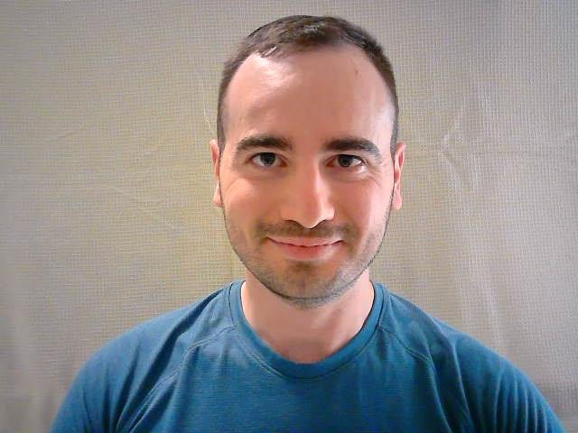
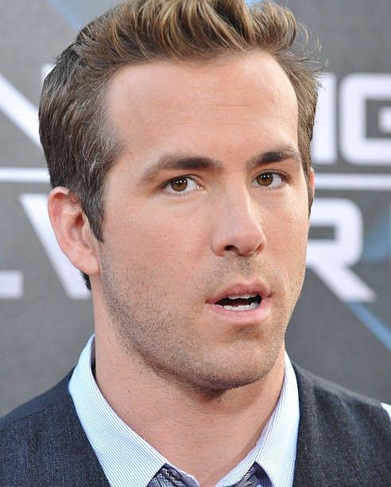
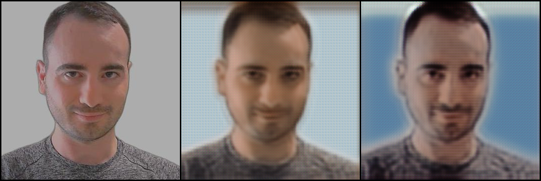
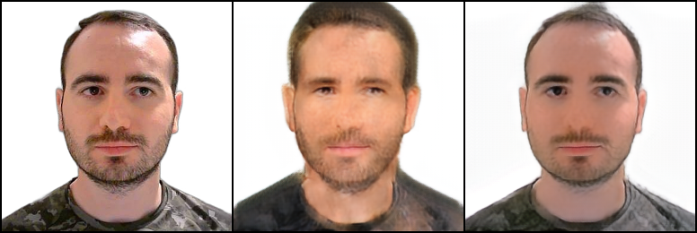
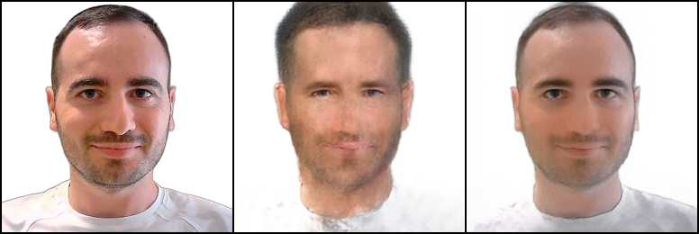
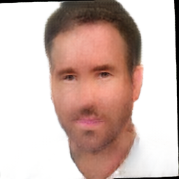
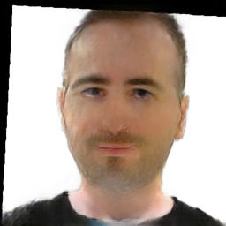
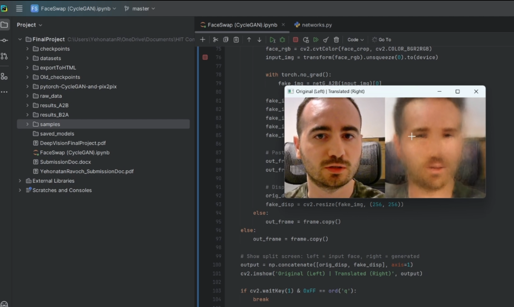

# Face Swap using CycleGAN (Unpaired Image-to-Image Translation)

This project implements a **CycleGAN-based face domain translation system** for unpaired image-to-image translation, demonstrated on human faces.  
The model learns a bidirectional mapping between two face domains:
- **Domain A**: Author’s face
- **Domain B**: Public celebrity face domain *(e.g., Ryan Reynolds)*

The project includes both **offline inference results** and a **live camera domain-shift demonstration**.

<p align="center">
  
  &nbsp;&nbsp;&nbsp;
  
</p>


---

## Project Overview

- **Task**: Unpaired Image-to-Image Translation (Face Swap)
- **Model**: CycleGAN
- **Learning Type**: Unsupervised / Unpaired Learning
- **Framework**: PyTorch
- **Focus**: Understanding GAN behavior, cycle consistency, and domain adaptation limitations

---

## Motivation

Paired face datasets are expensive and difficult to obtain.  
This project explores how **CycleGAN** can learn meaningful domain mappings **without paired supervision**, relying on:
- Adversarial learning
- Cycle consistency constraints
- Implicit structure preservation

The goal was not perfect identity replication, but **domain-level style transfer** and a deep understanding of the underlying mechanics.

---

## Dataset (Excluded from Repository)

Due to size and privacy constraints, datasets are not included in this repository.

Expected directory structure (standard CycleGAN format):
```
datasets/
├── trainA/
├── trainB/
├── valA/
├── valB/
├── testA/
└── testB/
```

Each domain contained **1,000 images**.

---

## Methodology

### 1. Preprocessing
- Face cropping and alignment
- Resizing and normalization
- Domain separation (A / B)

### 2. Model Architecture
- **Generators**: ResNet-based encoder–decoder CNNs  
- **Discriminators**: PatchGAN
- **Loss Functions**:
  - Adversarial GAN Loss
  - Cycle Consistency Loss (L1)
  - Identity Loss (optional)

### 3. Training Strategy
- Bidirectional training (A → B and B → A)
- Periodic sampling per epoch
- Checkpointing best-performing and final models

---

## Training Progression (Qualitative Analysis)

The following samples illustrate how the model evolves during training:

**Early Epochs – unstable mapping**


**Mid Training – improved structure preservation**


**Late Training – stable domain translation**


Each image shows:
```
[ Real A | Generated B | Reconstructed A ]
```


These results highlight both the **strengths and limitations** of unpaired translation in face domains.

---

## Inference Results

Final inference examples for both directions:

### Domain A → Domain B


### Domain B → Domain A


The model captures **global facial style and texture**, while fine identity details remain challenging — a known limitation of CycleGAN for face swapping.

---

## Live Domain Shift Demonstration

As part of the course requirements, a **live webcam demonstration** was implemented.

[](demo/domain_shift_live_demo.mp4)

Real-time webcam input processed by the trained CycleGAN generator, 
demonstrating unpaired face domain translation.

---

## Repository Notes

- Datasets and model checkpoints are intentionally excluded
- Base CycleGAN implementation adapted from:
  - `pytorch-CycleGAN-and-pix2pix` (cloned externally)
- This repository focuses on **experimentation, analysis, and learning**, not on providing pretrained models

---

## Key Learning Outcomes

- Practical implementation of GAN training loops in PyTorch
- Deep understanding of CycleGAN loss interactions
- Experience with unpaired datasets and domain adaptation
- Analysis of failure modes in generative models
- Bridging academic requirements with real-time demonstrations

---

## Technologies & Keywords

- Python
- PyTorch
- CycleGAN
- GANs
- Computer Vision
- CNN, Encoder–Decoder
- Unsupervised Learning
- Image-to-Image Translation
- Domain Adaptation
- Deep Learning Research

---

## Author

**Yehonatan Ravoch**  
B.Sc. Computer Science (Data Science)  
Holon Institute of Technology (HIT)
